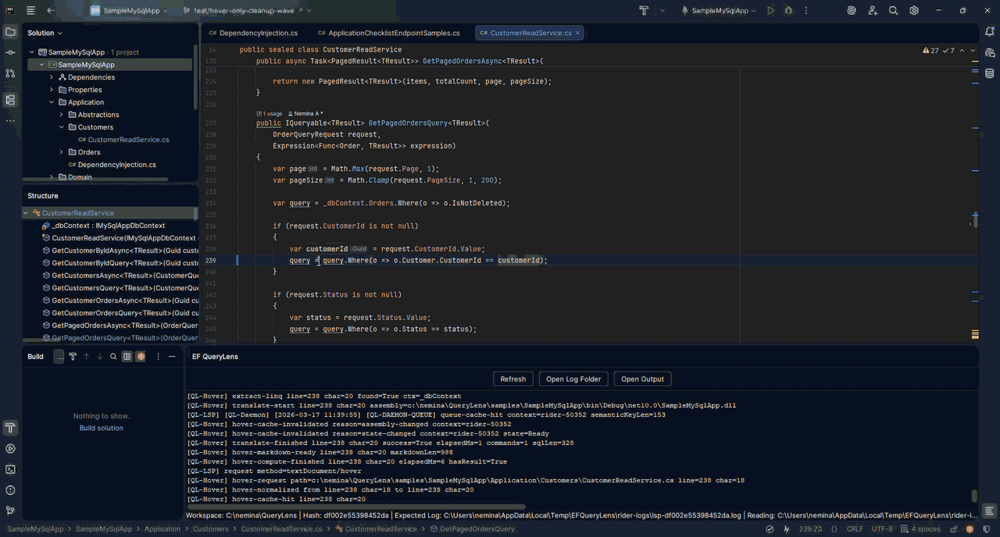
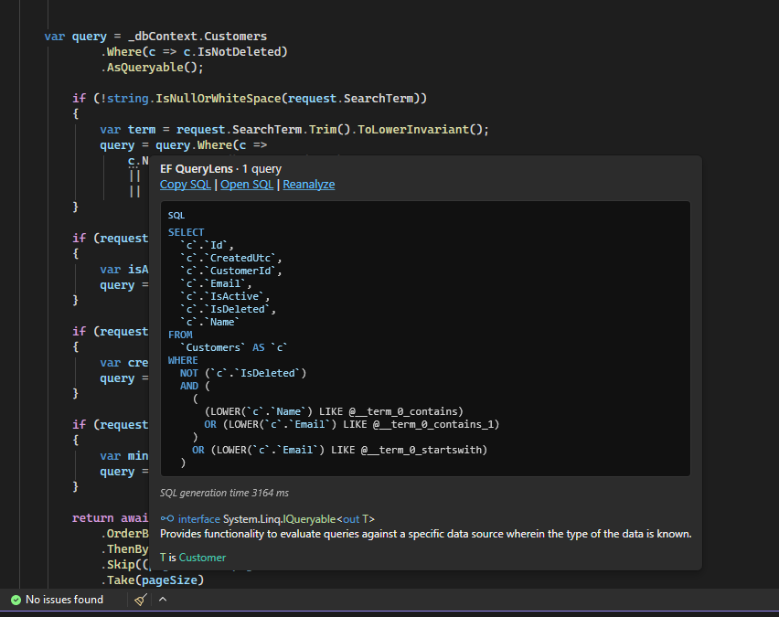
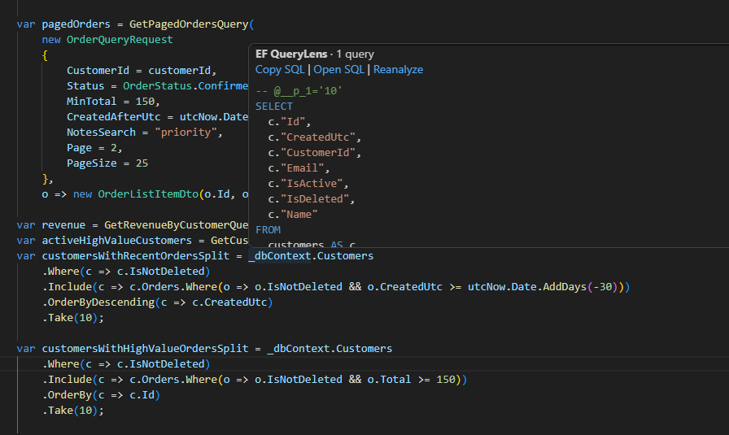
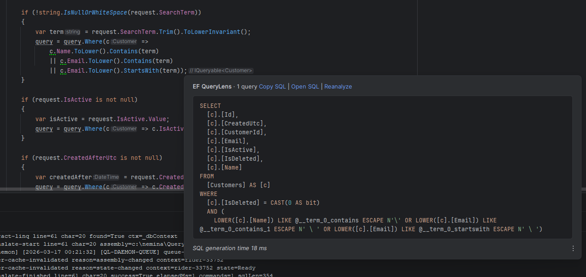

<div align="center">
  
  <h1>EF QueryLens</h1>
  <p><strong>See the SQL behind every LINQ expression — right in your editor.</strong></p>
  <p>
    
  </p>
</div>

---

EF QueryLens translates EF Core LINQ to SQL at hover time. A shared daemon does the work; lightweight plugins for **VS Code**, **Rider**, and **Visual Studio** show the result. No database connection needed.

<br/>

## See it in action

<table>
  <tr>
    <td align="center" width="50%">
      <strong>Hover SQL preview</strong><br/><br/>
      
    </td>
    <td align="center" width="50%">
      <strong>Edit &amp; re-preview</strong><br/><br/>
      
    </td>
  </tr>
</table>

<br/>

## Works everywhere

<table>
  <tr>
    <td align="center" valign="top" width="33%">
      <strong>Visual Studio</strong><br/><br/>
      
    </td>
    <td align="center" valign="top" width="33%">
      <strong>VS Code</strong><br/><br/>
      
    </td>
    <td align="center" valign="top" width="33%">
      <strong>JetBrains Rider</strong><br/><br/>
      
    </td>
  </tr>
</table>

<br/>

## What you get

| Feature | Detail |
|---|---|
| Hover SQL preview | Generated SQL on any LINQ expression |
| Copy & Open actions | One-click copy or open in a dedicated SQL panel |
| Split-query rendering | Multi-statement queries shown with per-split labels |
| Shared backend | One daemon process, consistent results across all IDEs |
| Provider-aware | MySQL, PostgreSQL, SQL Server formatted correctly |
| Offline | No database connection — works from your compiled assembly |
| MCP server | Expose translations to AI agents and automation |

<br/>

## Quick Start

> [!IMPORTANT]
> **Prerequisite:** Install **.NET 10** before using EF QueryLens.
> - **Extension usage:** .NET 10 Runtime + ASP.NET Core Runtime
> - **Building from source:** .NET 10 SDK
>
> EF QueryLens launches bundled backend processes via `dotnet`, so SQL preview features will not start if .NET 10 is missing.

Install quickly with the official installer scripts:

**PowerShell (Windows)**

```powershell
Invoke-WebRequest https://dot.net/v1/dotnet-install.ps1 -OutFile dotnet-install.ps1
.\dotnet-install.ps1 -Channel 10.0 -Runtime dotnet
.\dotnet-install.ps1 -Channel 10.0 -Runtime aspnetcore
# Optional (only for local build/dev):
.\dotnet-install.ps1 -Channel 10.0
```

**Bash (Linux/macOS)**

```bash
curl -fsSL https://dot.net/v1/dotnet-install.sh -o dotnet-install.sh
chmod +x dotnet-install.sh
./dotnet-install.sh --channel 10.0 --runtime dotnet
./dotnet-install.sh --channel 10.0 --runtime aspnetcore
# Optional (only for local build/dev):
./dotnet-install.sh --channel 10.0
```

**1. Add a factory to your executable project**

QueryLens needs a factory class to create an offline `DbContext` for SQL generation. Add it to your **executable startup project** (ASP.NET API, Worker Service, Console app) — not a class library.

First, define the interface (or reference `EFQueryLens.Core`):

```csharp
namespace EFQueryLens.Core;

public interface IQueryLensDbContextFactory<out TContext>
    where TContext : DbContext
{
    TContext CreateOfflineContext();
}
```

Then implement it. This is where you configure your provider, extensions like `UseProjectables()` or Gridify, query splitting behaviour, custom conventions — anything that affects the generated SQL:

```csharp
public sealed class AppQueryLensFactory : IQueryLensDbContextFactory<AppDbContext>
{
    public AppDbContext CreateOfflineContext()
    {
        var options = new DbContextOptionsBuilder<AppDbContext>()
            .UseSqlServer("Server=offline;Database=offline")
            .UseProjectables()                              // Projectable properties
            .UseQuerySplittingBehavior(SplitQuery)          // Split-query rendering
            .Options;

        return new AppDbContext(options);
    }
}
```

The connection string is never opened — it only tells EF Core which provider dialect to use.

> See the full sample: [`samples/SampleMySqlApp/QueryLensDbContextFactory.cs`](samples/SampleMySqlApp/QueryLensDbContextFactory.cs)

**2. Build the solution**

```bash
dotnet build EFQueryLens.slnx
```

**3. Install the extension**

| IDE | Install |
|---|---|
| VS Code | [Marketplace](#) *(coming soon)* |
| JetBrains Rider | [JetBrains Marketplace](#) *(coming soon)* |
| Visual Studio | [VS Marketplace](#) *(coming soon)* |

**4. Hover any LINQ expression**

Point at a LINQ query. SQL appears. Use the hover actions to copy, open the full panel, or refresh.

<br/>

## Documentation

- [Getting Started](docs/getting-started.md)
- [IDE Support](docs/ide-support.md)
- [Architecture](docs/architecture.md)
- [Providers](docs/providers.md)
- [CLI Reference](docs/cli-reference.md)
- [MCP Server](docs/mcp-server.md)

<br/>

## Build & Test

<details>
<summary>Full build commands</summary>

```bash
# .NET solution
dotnet build EFQueryLens.slnx
dotnet test EFQueryLens.slnx

# VS Code plugin
npm ci --prefix src/Plugins/ef-querylens-vscode
npm run compile --prefix src/Plugins/ef-querylens-vscode

# Rider plugin
cd src/Plugins/ef-querylens-rider
./gradlew build
```

</details>

<br/>

## Contributing

See [CONTRIBUTING.md](CONTRIBUTING.md).

## Security

See [SECURITY.md](SECURITY.md).

## License

MIT — see [LICENSE](LICENSE).
