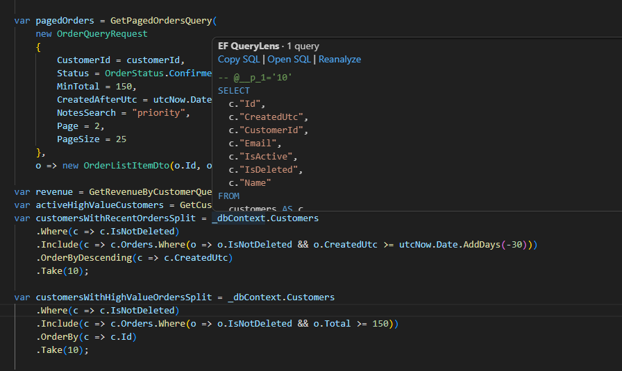
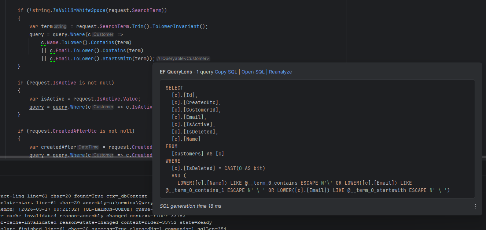
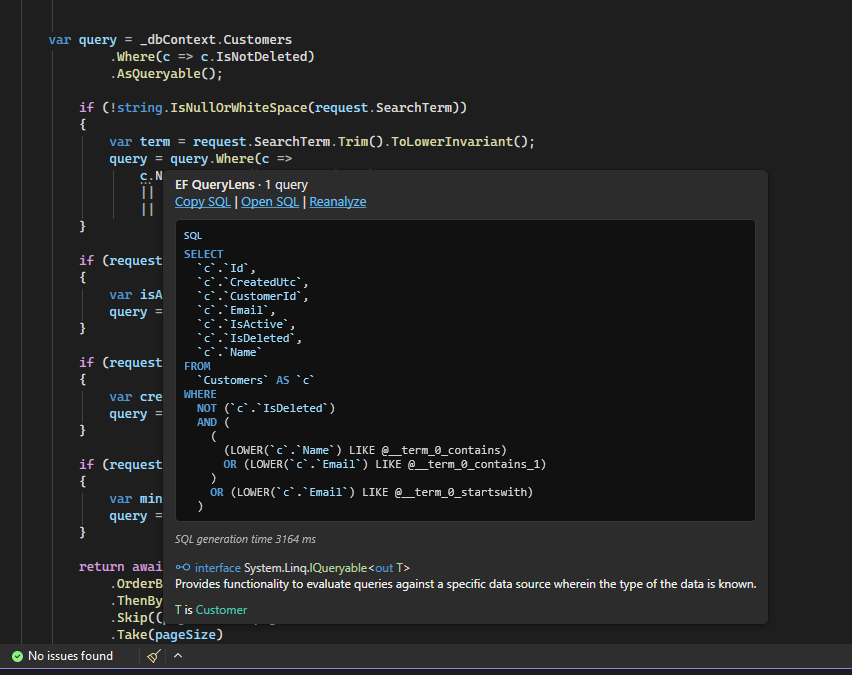

# IDE Support

EF QueryLens currently ships active IDE plugins for VS Code, Rider, and Visual Studio, all backed by the same LSP and daemon runtime.

## VS Code

- Plugin path: `src/Plugins/ef-querylens-vscode`
- Command/config prefix: `efquerylens.*`
- Key actions: Show SQL Preview, Copy SQL, Open SQL, Refresh

Screenshot:



## Rider

- Plugin path: `src/Plugins/ef-querylens-rider`
- Key actions: copy sql, open sql, refresh
- Hover preview and highlight support enabled through Rider LSP APIs

Screenshot:



## Visual Studio

- Plugin path: `src/Plugins/ef-querylens-visualstudio`
- Key actions: copy sql, open sql, refresh
- Structured split-query rendering support

Screenshots:




## Shared Backend

All three IDE clients use:

- `EFQueryLens.Lsp` for request/response orchestration
- `EFQueryLens.Daemon` for runtime query translation services
- `EFQueryLens.Core` for transport-agnostic engine contracts

This shared architecture keeps behavior consistent across IDEs and reduces feature drift.

## LSP extensions

All IDE clients are thin wrappers around the same `EFQueryLens.Lsp` server. Shared wire contracts live in `EFQueryLens.Lsp.Protocol` (C#) and are mirrored in TypeScript (VS Code) and Kotlin (Rider).

### Custom requests

| Method | Purpose |
|--------|---------|
| `efquerylens/status` | Poll current host snapshot (state, warmed flag, inflight count) |
| `efquerylens/warmup` | Pre-warm assembly for the active document/position |
| `efquerylens/hover` | Structured hover payload (Visual Studio Quick Info) |
| `efquerylens/daemon/restart` | Restart the translation daemon |
| `efquerylens/setup/detect` | Detect whether factory setup is required |
| `efquerylens/setup/apply` | Generate or update the offline DbContext factory |

Standard LSP `textDocument/hover` is used by VS Code and Rider for markdown hovers. Both routes share `HoverRequestCoordinator` on the server.

### SQL-ready notifications (client-polled)

When an uncached hover returns **InQueue**, clients start a background poll on `efquerylens/hover` (or structured preview) until status is **Ready** or a timeout (at least 15s, up to 120s). Then they show a toast with **Go to Query** / **Open SQL**. Cached hovers return SQL immediately and do not start a toast watch.

The server no longer pushes `efquerylens/sqlReady`. That notification name is **deprecated**.

Clients dedupe by `(fileUri, line, character)` for 30 seconds and respect `sqlReadyNotify` / **Notify when SQL is ready** from client settings.

### Custom notifications (server → client)

| Notification | Purpose |
|--------------|---------|
| `efquerylens/statusChanged` | Push updated host status snapshot |
| `efquerylens/showSqlPreview` | Open SQL in editor (optional server-driven) |
| `efquerylens/showSqlPopup` | Show SQL popup (optional server-driven) |
| `efquerylens/copySqlToClipboard` | Copy SQL text |

#### Deprecated: `efquerylens/sqlReady`

Previously used for server-push SQL-ready toasts. Clients now poll hover status instead.

#### `efquerylens/statusChanged` payload

```json
{
  "State": "Ready",
  "Message": "Ready",
  "AssemblyPath": "C:\\path\\to\\App.dll",
  "InflightCount": 0,
  "Warmed": true
}
```

Status bars treat **Ready** only when `State=Ready` **and** `Warmed=true`. Otherwise the UI shows **Warming**.

### Client configuration

Sent on LSP initialize and via `workspace/didChangeConfiguration`:

```json
{
  "queryLens": {
    "debugEnabled": true,
    "enableLspHover": true,
    "hoverProgressNotify": false,
    "sqlReadyNotify": true,
    "hoverProgressDelayMs": 350,
    "hoverCacheTtlMs": 15000,
    "markdownQueueAdaptiveWaitMs": 200,
    "structuredQueueAdaptiveWaitMs": 200,
    "warmupSuccessTtlMs": 60000,
    "warmupFailureCooldownMs": 5000,
    "hoverWaitWhenWarmMs": 0
  }
}
```

| Key | Description |
|-----|-------------|
| `sqlReadyNotify` | Enable SQL-ready toasts when background poll sees Ready (default: `true`) |
| `enableLspHover` | `false` for VS structured Quick Info; `true` for markdown hover IDEs |
| `hoverWaitWhenWarmMs` | Max wait for SQL when assembly is already warm. Default `0` returns processing immediately and notifies when background SQL is ready. |

### Parity checklist (all IDEs)

1. Hover a LINQ query → see **InQueue** / warming status while translation runs.
2. Dismiss hover early → client polls until Ready → toast with **Go to Query** and **Open SQL**.
3. Status bar shows **Warming** until warmup completes, then **Ready** with `Warmed=true`.
4. Second hover on the same query → fast cached path; inline SQL in hover (no toast).
5. Disable **Notify when SQL is ready** → no toast.
6. VS structured hover and Rider/VS Code markdown hover produce the same SQL (shared coordinator).

### Troubleshooting stale assemblies

If SQL or factory state looks wrong after a **terminal rebuild** (without saving in the IDE):

1. Save any `.cs` file, or run **Restart QueryLens Daemon** from the IDE.
2. With `QUERYLENS_DEBUG=1`, check logs for `factory-miss` lines (`source=`, `shadow=`, `fingerprint=`).
3. Escape hatch: delete `%LocalAppData%\EFQueryLens\shadow` and restart the daemon.

### IDE-specific settings

| IDE | Settings location |
|-----|-------------------|
| VS Code | `efquerylens.notifyWhenSqlReady` in settings.json |
| Visual Studio | Tools → Options → EF QueryLens → General |
| Rider | Settings → Tools → EF QueryLens (project) |
